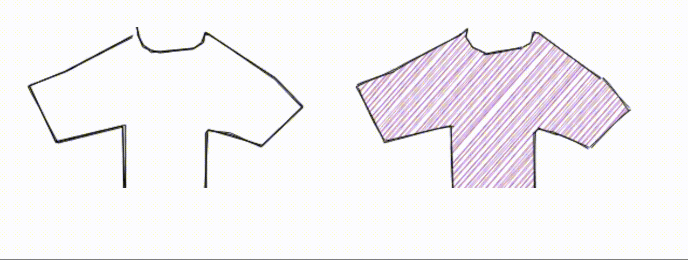

# Quickdraw -> Human -> Laser

Render modified drawings making characters from components of the quickdraw dataset.

By rendering these drawings on canvas, they will also be sent to a server which will use the Helios DAC SDK to render these characters on a laser projector.

This work is very WIP and will be updated with in-progress photos and videos.

