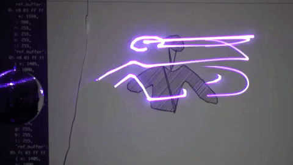

# Quickdraw -> Human -> Laser

Render modified drawings making characters from components of the quickdraw dataset.

By rendering these drawings on canvas, they will also be sent to a server which will use the Helios DAC SDK to render these characters on a laser projector.

The server uses use a FFI Library with a previously compared shared library.

Currently, other than waiting on vertice edges and between drawings, no optimization is done.
Optimization needs to be added around smoothing lines for the galvo inputs based on time it takes for angles and optimizing when the laser is "blanked" for a time to prevent artifacts from the galvo movement / acceleration.

This work is very WIP and will be updated with in-progress photos and videos.

